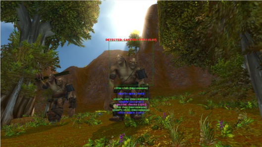
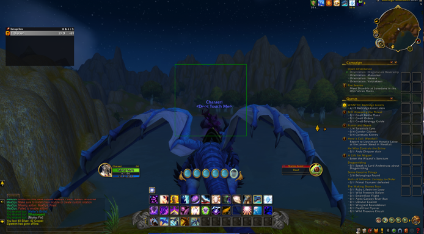
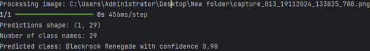
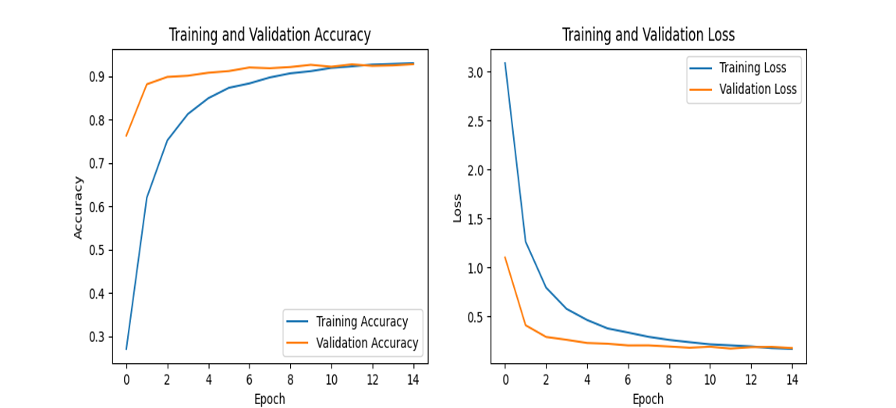
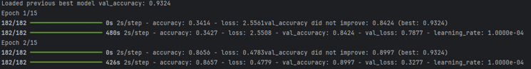

# 🧠 World of Warcraft Mob Recognition

## 📌 Project Summary

This project is an educational computer vision application built in Python.  
Its goal is to identify mobs (NPC enemies) from World of Warcraft screenshots using a custom-trained CNN model and display the items those mobs drop.

The project combines machine learning, image preprocessing, and in-game logic mapping to simulate how an intelligent system could support or enhance gameplay analytics. While not connected directly to the game engine, it demonstrates core AI tasks: object classification, data augmentation, inference logic, and UI interaction.

## 🎮 Context and Concept

World of Warcraft features thousands of mobs (non-playable characters or monsters) with diverse appearances and loot tables. Recognizing them visually from screenshots is a human skill — but can it be taught to an AI?

This application attempts to answer that by:
- Building a dataset of images using 3D models from Wowhead.com
- Training a model to recognize 39 mob types
- Associating each with its typical loot items, labeled by rarity (common, rare, epic, legendary)
- Providing a lightweight UI for quick detection and display

## 🧩 Core Features

- Mob Recognition using a fine-tuned EfficientNetB0 model
- Image Capture & Inference via drag-and-drop or screenshot input
- Loot Display based on predicted mob, shown with color-coded rarity
- Augmented Dataset (rotation, flipping, contrast)
- Console output + GUI overlay
- Custom loot mapping via dictionary lookup
- Training & validation history visualized

## 🚀 How It Works

1. Input: An image containing a WoW mob (from screenshot, capture, or 3D model)
2. Preprocessing: Resize to 224x224, normalize pixel values
3. Model Inference: EfficientNetB0 returns class probabilities
4. Postprocessing:
   - Identify most likely mob
   - Map mob to predefined loot list
   - Display loot in UI overlay or print to console

## 🏗️ Architecture Diagram

            +----------------+
            |  Input Image   |
            +----------------+
                    ↓
            +----------------+
            | Preprocessing  |
            +----------------+
                    ↓
            +------------------------+
            | EfficientNetB0 Model   |
            +------------------------+
                    ↓
            +-----------------------------+
            | Predicted Mob + Confidence |
            +-----------------------------+
                    ↓
            +------------------------------+
            | Loot Lookup & UI Display    |
            +------------------------------+

## 📸 Screenshots

### Detection in Game
|  |  |

### Prediction & UI
  

### Model Performance
  

## 🧠 Model Details

Architecture: EfficientNetB0 (pretrained on ImageNet)  
Fine-tuning: Last 10 layers unfrozen

Training:
- Epochs: 15
- Batch size: 32
- Loss: sparse_categorical_crossentropy
- Optimizer: Adam
- Callbacks: EarlyStopping, ModelCheckpoint, ReduceLROnPlateau

Dataset:
- 39 classes (mobs)
- ~500 images per class (over 19,000 total)
- Generated from Wowhead 3D viewer
- Augmentations: rotation, flip, brightness, zoom
- Format: 224x224 RGB, normalized

## 🔧 Installation & Usage

### 1. Clone the repo

git clone https://github.com/yourusername/wow-mob-recognition.git  
cd wow-mob-recognition

### 2. Install dependencies

pip install -r requirements.txt

### 3. Run detection

python detect.py --img path_to_image.png

### 4. Run training (optional)

python train.py

## 📁 File Structure

.
├── train.py             # Training pipeline  
├── test.py              # Evaluation / confusion matrix  
├── detect.py            # Inference on input image  
├── loot.py              # Loot dictionary logic  
├── model/               # Saved model weights  
├── assets/              # Screenshots for README  
├── data/                # Images (ignored in .gitignore)  
├── requirements.txt     # Dependencies  
└── README.md

## ❗ Legal & Ethical Disclaimer

This project is intended for educational and experimental purposes only.  
All in-game content, mob names, and visuals are property of Blizzard Entertainment and are referenced here solely for non-commercial demonstration.

No game assets are redistributed, and all dataset images are user-generated via screenshots or Wowhead's public 3D viewer.

## 👨‍💻 Authors

Robert-Constantin Preda
Dragoș-Gabriel Petrescu
Dănuț-Cristian Rădulescu
Faculty of Automation, Computers and Electronics, University of Craiova  
Class of 2025 – Bachelor in Automation and Applied Informatics

## 🤝 Contributions

Pull requests and forks are welcome for model improvement, dataset expansion, or adding real-time webcam detection.

If you like the project, consider starring it or sharing your results.
